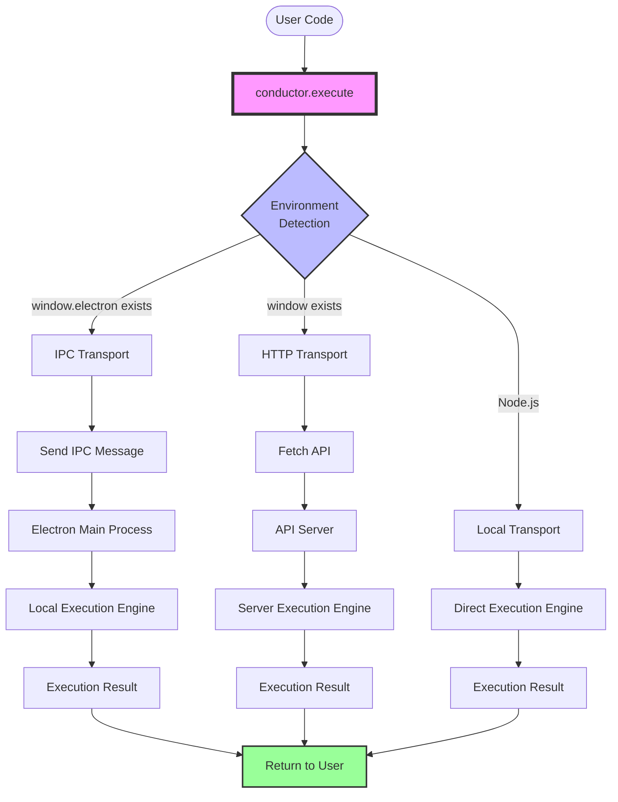
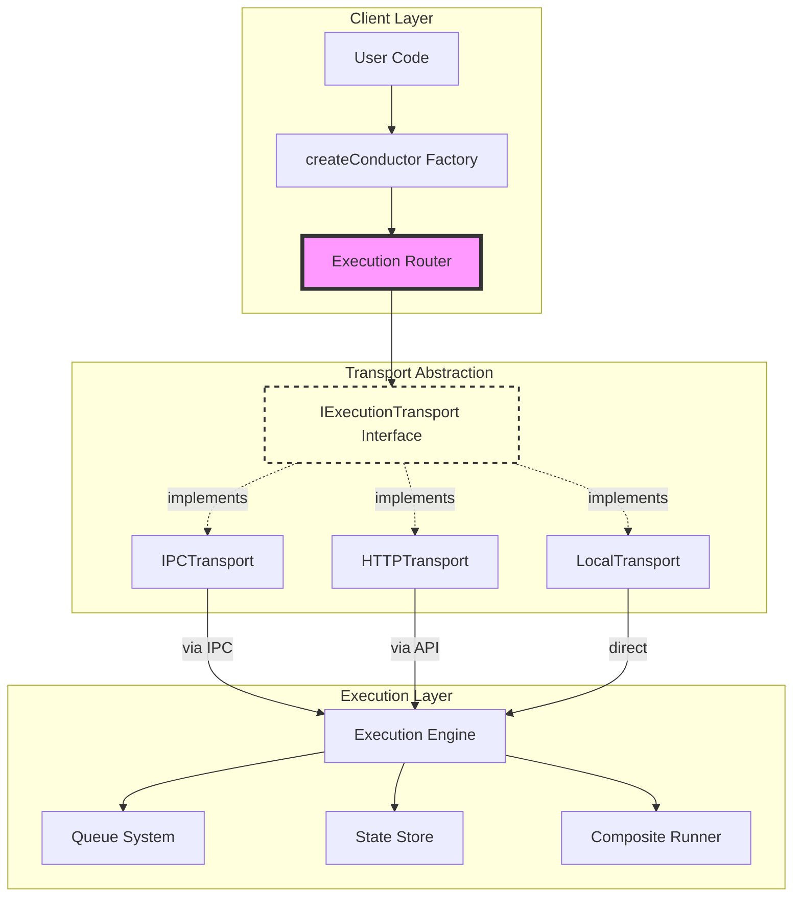
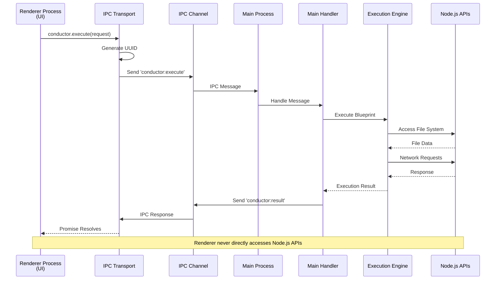
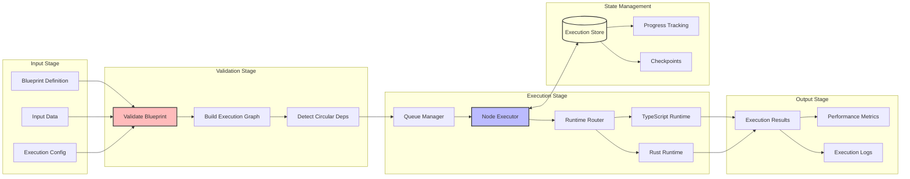
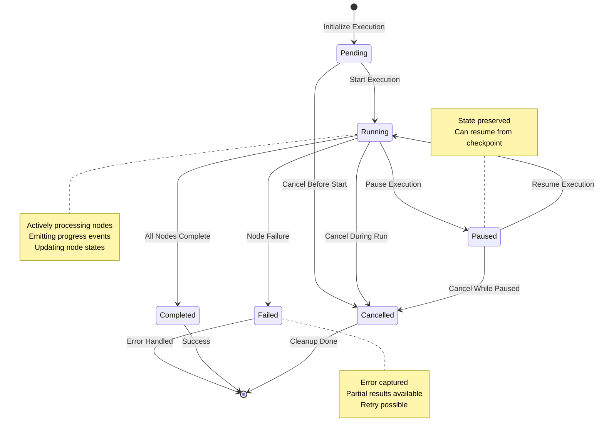
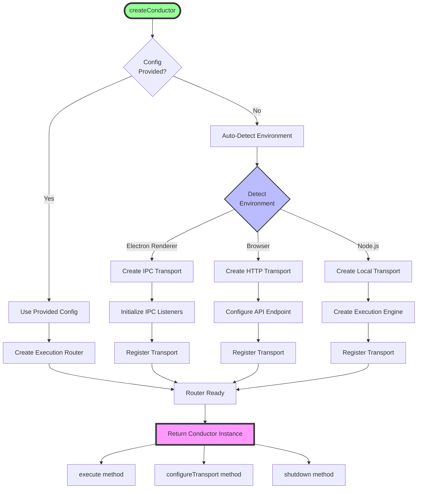
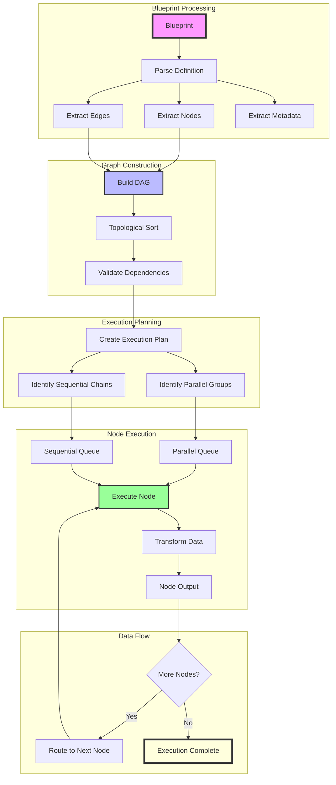
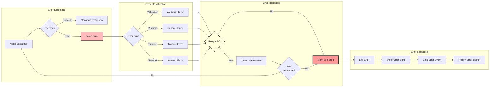

# Conductor Architecture - Mermaid Diagrams

Visual documentation of the Conductor package architecture using Mermaid
diagrams that render natively on GitHub.

## Table of Contents

- [Conductor Architecture - Mermaid Diagrams](#conductor-architecture---mermaid-diagrams)
  - [Table of Contents](#table-of-contents)
  - [Unified API Flow](#unified-api-flow)
  - [Transport Layer Architecture](#transport-layer-architecture)
  - [Electron IPC Communication](#electron-ipc-communication)
  - [Execution Pipeline](#execution-pipeline)
  - [State Management Flow](#state-management-flow)
  - [Factory Pattern Creation](#factory-pattern-creation)
  - [Blueprint Execution Flow](#blueprint-execution-flow)
  - [Error Handling Flow](#error-handling-flow)
  - [Module Dependencies](#module-dependencies)
  - [Usage in Documentation](#usage-in-documentation)
    - [Example Usage in README:](#example-usage-in-readme)
    - [Benefits of Mermaid on GitHub:](#benefits-of-mermaid-on-github)

## Unified API Flow

How the conductor provides a single API across all environments:



## Transport Layer Architecture

Detailed transport layer showing how different environments are abstracted:



## Electron IPC Communication

Detailed flow of IPC communication in Electron environment:



## Execution Pipeline

The complete execution pipeline from blueprint to result:



## State Management Flow

How execution state is managed throughout the lifecycle:



## Factory Pattern Creation

How `createConductor()` sets up the entire system:



## Blueprint Execution Flow

Detailed flow of how a blueprint is executed:



## Error Handling Flow

How errors are handled throughout the execution:



## Module Dependencies

How the conductor modules depend on each other:

```mermaid
graph BT
    subgraph "External Packages"
        Events[@atomiton/events]
        Store[@atomiton/store]
        Utils[@atomiton/utils]
        Nodes[@atomiton/nodes]
    end

    subgraph "Core Modules"
        Conductor[conductor.ts]
        Transport[transport/]
        Engine[engine/]
        Execution[execution/]
        Queue[queue/]
        StoreModule[store/]
    end

    subgraph "Runtime Modules"
        Runtime[runtime/]
        Workers[workers/]
        Electron[electron/]
    end

    Engine --> Events
    Engine --> Store
    Engine --> Execution

    Execution --> Nodes
    Execution --> Utils

    Queue --> Events
    Queue --> Utils

    StoreModule --> Store
    StoreModule --> Events

    Transport --> Engine
    Transport --> Events

    Conductor --> Transport
    Conductor --> Engine

    Runtime --> Workers
    Electron --> Transport

    style Conductor fill:#f9f,stroke:#333,stroke-width:4px
    style Events fill:#bbf,stroke:#333,stroke-width:2px
    style Store fill:#bbf,stroke:#333,stroke-width:2px
```

---

## Usage in Documentation

These Mermaid diagrams will render automatically when viewed on GitHub. You can
reference them in other documentation files or include them in README files
throughout the project.

### Example Usage in README:

```markdown
See the [Conductor Architecture Diagrams](./CONDUCTOR_MERMAID_DIAGRAMS.md) for
visual representations of how the system works.
```

### Benefits of Mermaid on GitHub:

- 🎨 **Native Rendering**: No external tools needed
- 🔄 **Version Controlled**: Diagrams update with code
- 🎯 **Interactive**: Click and zoom on GitHub
- 📱 **Responsive**: Works on all devices
- 🔗 **Linkable**: Can link to specific diagrams

These diagrams provide a clear visual understanding of the conductor's
architecture and make it easy for new developers to understand the system!
