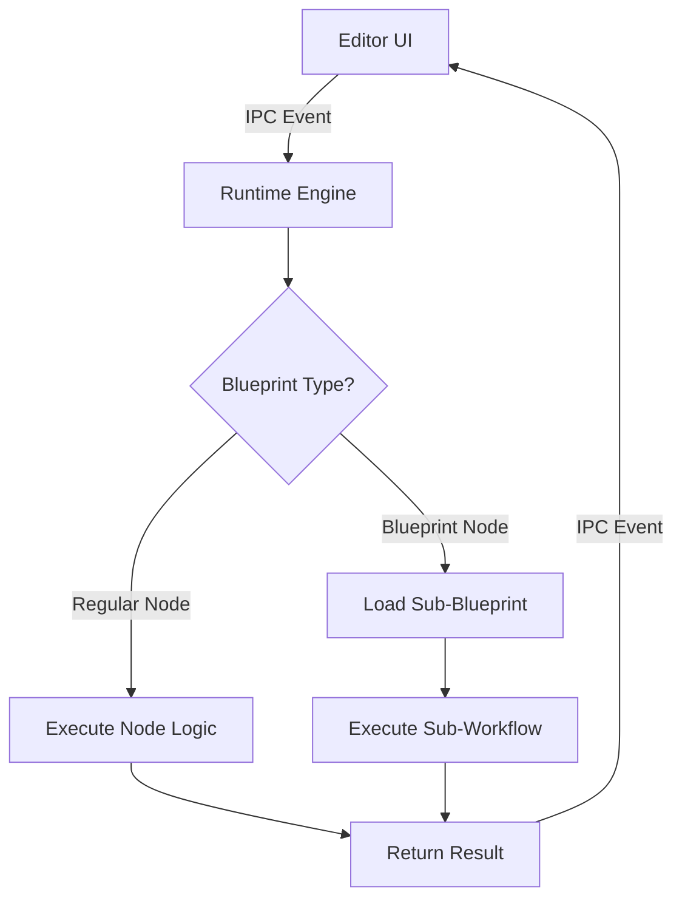

# Conductor Documentation

## Overview

The @atomiton/conductor package provides the execution orchestrator for Atomiton Blueprints and nodes. This documentation covers the architecture, implementation strategy, and design decisions.

## Documentation Structure

- [Blueprint Execution](./BLUEPRINT_EXECUTION.md) - How Blueprints are stored, loaded, and executed
- [Execution Strategy](./EXECUTION_STRATEGY.md) - Runtime architecture and technology choices
- [IPC Integration](./IPC_INTEGRATION.md) - Communication between renderer and main process

## Core Concepts

### What is the Conductor?

The runtime is responsible for:

1. **Orchestration** - Managing the execution flow of Blueprints
2. **Node Execution** - Running individual nodes with their logic
3. **Data Flow** - Passing data between connected nodes
4. **State Management** - Tracking execution progress and results
5. **Error Handling** - Managing failures and recovery

### Desktop-First Architecture

Our runtime runs in Electron's main process, providing:

- Full Node.js API access (file system, child processes)
- Security isolation from the renderer
- Direct OS integration
- Offline-first operation

### MVP Philosophy

We're starting with a pure TypeScript implementation because:

- **Simplicity** - Single language reduces complexity
- **Speed to Market** - Ship faster, iterate based on feedback
- **Proven Approach** - JavaScript powers n8n, Zapier, Make successfully
- **Measure First** - Optimize based on real bottlenecks, not assumptions

## Key Design Decisions

### 1. Blueprints ARE Nodes

Blueprints extend the base Node class from @atomiton/nodes, enabling:

- Infinite composition (Blueprints containing Blueprints)
- Unified type system
- Single execution model
- Consistent testing approach

### 2. YAML Storage Format

We chose YAML over JSON for Blueprint storage:

- Human-readable with comment support
- Cleaner Git diffs for version control
- 30% smaller file size
- Converts to JSON at runtime

### 3. Progressive Enhancement

Starting simple with room to grow:

```typescript
// MVP: TypeScript only
interface INode {
  execute(): Promise<Result>;
}

// Future: Multi-runtime support via versioning
interface INode {
  version: "2.0.0"; // New version can add runtime spec
  runtime?: { language: "rust" | "python" | "wasm" };
}
```

### 4. IPC via Events Package

Leveraging @atomiton/events for communication:

- Unified event API for both renderer and main
- EventEmitter3 for performance
- Type-safe event definitions
- Decoupled architecture

## Execution Flow



## Performance Strategy

### Current (MVP)

- TypeScript/Node.js for all nodes
- Worker Threads for CPU-intensive operations
- Streaming for large data sets
- In-memory queue (p-queue)

### Future (Based on Metrics)

- Rust nodes via NAPI for computation
- WebAssembly for portable performance
- GPU acceleration for ML/image processing
- Distributed execution for scale

## File Structure

```
runtime/
├── src/
│   ├── engine/           # Core execution engine
│   ├── storage/          # Blueprint storage layer
│   ├── execution/        # Node execution logic
│   ├── state/           # Execution state management
│   └── ipc/             # IPC communication layer
├── docs/                # This documentation
└── tests/              # Test suites
```

## Getting Started

See the [ROADMAP.md](../ROADMAP.md) for development timeline and milestones.

---

**Last Updated**: 2025-01-11
**Package**: @atomiton/runtime
**Status**: Architecture defined, implementation pending
